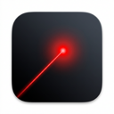
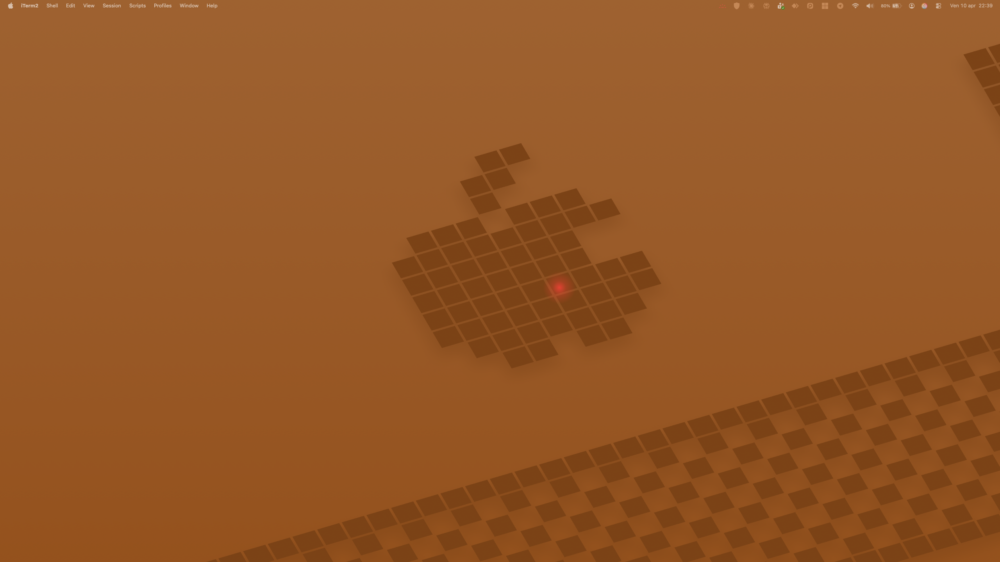
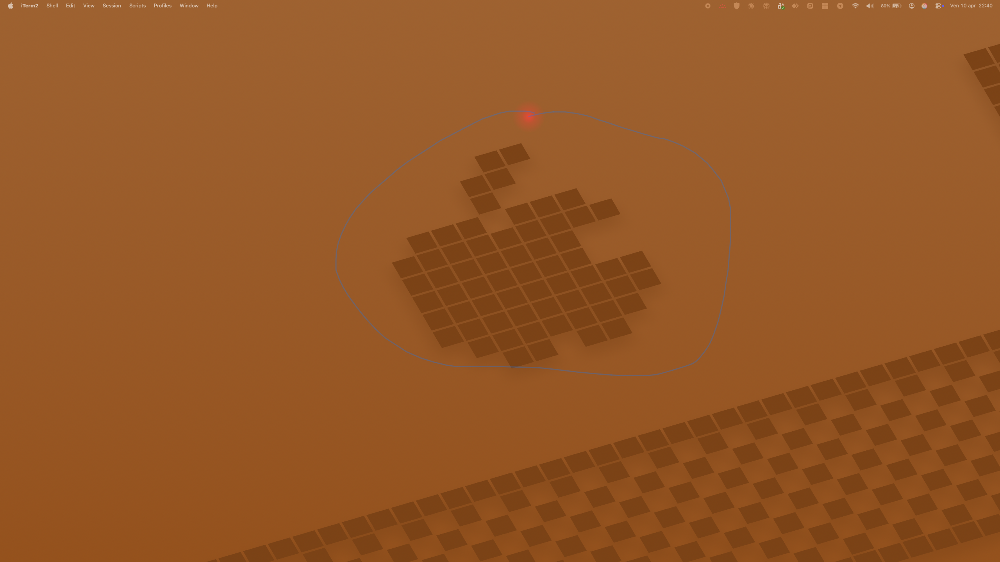
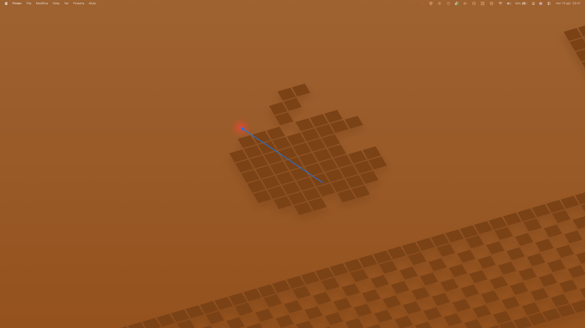

# LaserPointerMac

  

[🇮🇹 Italiano](#italiano) | [🇬🇧 English](#english)

---

## Screenshots

  
  
  

---

##  🇮🇹 Italiano

**LaserPointerMac** è una Menu Bar app nativa per macOS, scritta interamente in Swift e SwiftUI, pensata per chi fa presentazioni, demo, screencast o registrazioni schermo.
L'app crea un "puntatore laser" virtuale attorno al cursore del mouse, permettendo di evidenziare in tempo reale gli elementi a schermo, senza interferire con i click o le altre applicazioni.

### ✨ Funzionalità

- **Attivazione Veloce**: Accendi e spegni il laser con una scorciatoia da tastiera globale (default: `Option + Control + L`).
- **4 Tipi di Laser Visivo**:
  - `Dot`: Un classico puntino solido.
  - `Ring`: Un anello vuoto personalizzabile in spessore.
  - `Glow`: Un punto con una morbida sfumatura radiale (effetto "glow").
  - `Spotlight`: Scurisce l'intero schermo lasciando un cerchio di luce attorno al cursore.
- **Altamente Personalizzabile**: Modifica colore, dimensione, opacità, e aggiungi una sottile animazione pulsante.
- **Disegna Frecce al Volo**: Tieni premuta una scorciatoia (default: `Option + \`` o `Option + <` su layout ISO) **mentre** il laser è attivo per disegnare una freccia direzionale temporanea sullo schermo. Appena rilasci il tasto, la freccia scompare.
- **Disegno Libero con Dissolvenza** *(Novità v1.1)*: Tieni premuto `Option + Z` (configurabile) per disegnare liberamente sullo schermo seguendo il cursore. Al rilascio del tasto, il tracciato **non scompare di colpo** ma si dissolve gradualmente con una animazione di dissolvenza configurabile (0.3s – 5s). Funziona anche senza il laser attivo!
- **Tasti di scelta rapida singoli** *(Novità v1.2)*: Senza configurare nessuna scorciatoia, tieni premuto solo **Ctrl** per disegnare una freccia o solo **Option** per il disegno a mano libera. Se nei Settings imposti una scorciatoia personalizzata per una di queste azioni, quella scorciatoia prende il sopravvento e il tasto modificatore singolo viene disabilitato per quell'azione.
- **Supporto Multi-Monitor**: Il laser attraversa fluidamente tutti gli schermi (incluso l'iPad in modalità Sidecar).
- **Invisibile ai Click**: L'overlay è puramente visivo; puoi continuare a cliccare, scrivere e interagire con le app normalmente.

### 📥 Download (Pronto all'Uso)

Puoi scaricare l'app già compilata e pronta all'uso dalla pagina **[Releases](https://github.com/rrroddick/LaserPointerMac/releases)** di questo repository. Estrai lo zip e trascina `LaserPointerMac.app` nella cartella **Applicazioni**, poi avviala!

### 🛠 Dettagli Tecnici / Architettura

- **Linguaggio**: Swift 5+
- **Framework**: SwiftUI (Menu Bar e Settings), AppKit (Overlay, Event Monitoring), CoreGraphics (Rendering ad alte performance).
- **Architettura Rendering**: 
  - L'overlay del laser non è basato su view di SwiftUI (sarebbero troppo lente per seguire il mouse a 120Hz/60Hz), ma è un `NSPanel` trasparente (`.nonactivatingPanel`, `ignoresMouseEvents = true`, Level `CGWindowLevelForKey(.overlayWindow)`) con dentro una `NSView` custom.
  - Il disegno di laser e frecce avviene a bassissimo livello tramite `CGContext`.
  - Animazione e Tracking pilotati da un `CVDisplayLink` per garantire i massimi FPS sincronizzati con il refresh rate del monitor.
- **Event Monitoring**: Il tracciamento del cursore usa `NSEvent.mouseLocation`. Il rilevamento avanzato della tastiera (per il draw della freccia e del freehand) utilizza la libreria open-source **[KeyboardShortcuts](https://github.com/sindresorhus/KeyboardShortcuts)**.
- **Persistenza**: Implementata con `@AppStorage` (UserDefaults).

### 🚀 Installazione & Compilazione (Per Sviluppatori)

1. Clona il repository.
2. Apri `LaserPointerMac.xcodeproj` con Xcode 15 o superiore.
3. Attendi la risoluzione automatica della dipendenza SPM (`KeyboardShortcuts`).
4. Seleziona il tuo Mac come target di destinazione e fai Build & Run (`⌘ + R`).
5. **Permessi**: Al primo avvio, l'app richiederà i permessi di **Accessibilità** (tramite le Impostazioni di Sistema) necessari per intercettare le scorciatoie da tastiera a livello globale. (MacOS 14+ potrebbe richiedere implicitamente anche *Monitoraggio Input*).

---

##  🇬🇧 English

**LaserPointerMac** is a native macOS Menu Bar application written in Swift and SwiftUI, designed for presenters, educators, and screen recorders. 
It creates a virtual "laser pointer" effect around your mouse cursor, allowing you to highlight elements on screen in real-time without interfering with clicks or other application focus.

### ✨ Features

- **Quick Toggle**: Turn the laser on and off with a global keyboard shortcut (default: `Option + Control + L`).
- **4 Configurable Laser Types**:
  - `Dot`: A classic solid dot.
  - `Ring`: A customizable hollow ring.
  - `Glow`: A dot with a soft, radial gradient glow.
  - `Spotlight`: Darkens the entire screen while leaving a spotlight circle around the cursor.
- **Highly Customizable**: Change color, size, opacity, and toggle a subtle pulsing animation.
- **On-the-fly Arrow Drawing**: Hold down a shortcut (default: `Option + \`` or `Option + <` on ISO layouts) **while** the laser is active to draw a temporary directional arrow on the screen. The arrow vanishes instantly upon releasing the shortcut key.
- **Freehand Drawing with Fade-Out** *(New in v1.1)*: Hold `Option + Z` (configurable) to draw freely on screen while moving your cursor. When you release the key, the drawing doesn't disappear instantly — it fades out smoothly with a configurable dissolve effect (0.3s – 5s). Works independently of the laser!
- **Instant Modifier-Only Shortcuts** *(New in v1.2)*: Without configuring any shortcut, simply hold **Ctrl** alone to draw an arrow, or **Option** alone for freehand drawing. If you configure a custom shortcut for either action in Settings, the custom shortcut takes over and the modifier-only path is automatically disabled for that action.
- **Multi-Monitor Support**: The laser seamlessly transitions across all connected displays.
- **Click-Through Overlay**: The visual overlay is entirely non-interactive; you can type, click, and drag through it without interruption.

### 📥 Download (Ready-to-Use)

You can download the pre-compiled, ready-to-use application from the **[Releases](https://github.com/rrroddick/LaserPointerMac/releases)** page of this repository. Just extract the zip and drag `LaserPointerMac.app` to your **Applications** folder, then run it!

### 🛠 Technical Architecture under the hood

- **Language**: Swift 5+
- **Frameworks**: SwiftUI (Menu Bar, Settings UI), AppKit (Overlays, Event handling), Core Graphics (High-performance rendering).
- **Rendering Architecture**: 
  - To achieve maximum 60/120fps tracking, the laser is **not** rendered via SwiftUI `.overlay`. Instead, the app generates a transparent, click-through `NSPanel` (`.nonactivatingPanel`, `ignoresMouseEvents = true`, Level `CGWindowLevelForKey(.overlayWindow)`) containing a custom `NSView`.
  - Rendering for lasers, gradients, and arrows is done at a low level using `CGContext`.
  - Tracking and animations are synchronized with the monitor's refresh rate using a `CVDisplayLink`.
- **Event Monitoring**: Mouse polling utilizes `NSEvent.mouseLocation`. Advanced global hotkey listening (for the arrow and freehand mechanics) is powered by the excellent open-source library **[KeyboardShortcuts](https://github.com/sindresorhus/KeyboardShortcuts)**.
- **Persistence**: Managed automatically via state-driven `@AppStorage` (UserDefaults).

### 🚀 Build & Run

1. Clone the repository.
2. Open `LaserPointerMac.xcodeproj` with Xcode 15 or newer.
3. Swift Package Manager will automatically resolve the `KeyboardShortcuts` dependency.
4. Select your Mac as the destination and run (`⌘ + R`).
5. **Permissions**: On its first run, the app will prompt you to grant **Accessibility** permissions via System Settings. This is strictly required to monitor global keyboard shortcuts. (macOS 14+ may also require *Input Monitoring* depending on the shortcut).
